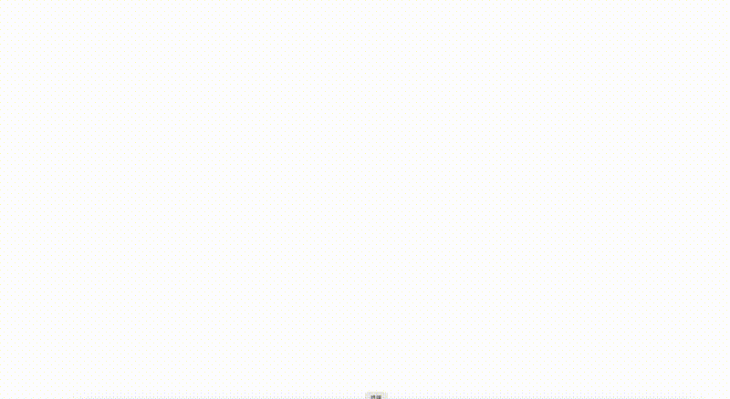

<p align="center">
  
</p>

<h1 align="center">Stitchflow</h1>
<p align="center"><strong>AI UI design that actually understands your project — not generic AI slop</strong></p>

<p align="center">
  <a href="README.zh-CN.md">🇨🇳 简体中文</a>
</p>

<p align="center">
  
  
  
  
  
</p>

---

## Demo

<p align="center">
  <a href="demo.mp4?raw=true">
    
  </a>
</p>
<p align="center"><em>Click the GIF to watch the full video →</em></p>

---

## The Problem

Ask any AI coding agent to "design a dashboard," and you'll get something. But it'll look like every other AI-generated UI — generic layouts, the same color schemes, the same "AI aesthetic." It doesn't know your brand. It doesn't understand your business. It hasn't read your product specs.

The result: code that looks fine at first glance, but feels hollow and unoriginal the moment you use it.

## What Stitchflow Does Differently

Stitchflow doesn't just pass your one-liner to an LLM and dump out code. It runs a **six-stage pipeline** that starts with understanding your project and ends with production-ready frontend code:

1. **Reads your project** — CLAUDE.md, brand data, product specs, existing UI — so it knows what you're building
2. **Crafts a tailored prompt** — not a template fill-in-the-blank, but a prompt written specifically for your business domain, brand colors, user personas, and functional needs
3. **Drives Google Stitch via CDP** — connects to your already-logged-in Chrome browser, selects the "Web" platform, auto-picks the strongest available model, types in the prompt, and kicks off generation
4. **Captures the result** — full-page screenshot for your review
5. **Exports HTML/CSS** — extracts the rendered design from Stitch
6. **Converts to real code** — your AI agent maps the design to your actual stack (React, Vue, plain HTML) with your project's conventions

The output isn't "an AI dashboard." It's *your* dashboard, for *your* brand, with *your* data.

## Installation

```bash
# 1. Install dependencies
pip install playwright && playwright install chromium

# 2. Log into your Google account in Chrome, then visit https://stitch.withgoogle.com/ once to authorize

# 3. Install to your AI coding agent
# Claude Code:
cp -r stitchflow ~/.claude/skills/

# Codex CLI:
cp -r stitchflow ~/.agents/skills/

# OpenClaw:
openclaw skill install --path ./stitchflow

# Cursor / Hermes / Gemini CLI:
cp -r stitchflow ~/.cursor/skills/     # Cursor
cp -r stitchflow ~/.hermes/skills/     # Hermes
cp -r stitchflow .agents/skills/       # Gemini CLI
```

## Usage

### With your AI agent (recommended)

After installation, just say:

> "Design an e-commerce operations dashboard with dark theme"

Your AI agent handles the entire pipeline — from reading your project context to delivering the final screenshot. Approve it, and it exports the code.

### CLI mode

```bash
# First time: launch CDP-enabled Chrome (closes existing Chrome windows)
python3 stitch.py --launch-chrome

# Generate a design
python3 stitch.py "your full design prompt" --output dashboard.png

# Full pipeline (launch + generate + export)
python3 stitch.py "your prompt" --launch-chrome --output dashboard.png --export .stitch/designs/
```

## Six-Stage Pipeline

```
Project Context → Tailored Prompt → Stitch Generation → Screenshot Review → Export HTML → AI Writes Code
```

| Stage | Who | What |
|-------|-----|------|
| 1. Understand | AI | Read CLAUDE.md, product data, brand assets, existing UI |
| 2. Prompt | AI | Write a Stitch prompt with brand colors, personas, page structure, feature requirements |
| 3. Launch | Script | Kill existing Chrome → clone profile (preserves login) → restart in CDP mode |
| 4. Generate | Script | Connect CDP → open Stitch home → select "Web" → auto-switch best model → type prompt → press Enter → poll until done |
| 5. Review | AI | Show screenshot to user, get approval or revision feedback |
| 6. Ship | Script+AI | Export HTML/CSS → AI reads → converts to React/Vue/static code |

## Cross-Platform

| | macOS | Windows | Linux |
|--|-------|---------|-------|
| Chrome Path | `/Applications/Google Chrome.app/...` | `%PROGRAMFILES%\Google\Chrome\...` | `google-chrome` (PATH) |
| Profile Path | `~/Library/Application Support/Google/Chrome` | `%LOCALAPPDATA%\Google\Chrome\User Data` | `~/.config/google-chrome` |
| Special Flags | None | `--disable-features=DevToolsDebuggingRestrictions` | None |

## Multi-Agent Compatibility

One SKILL.md, compatible across all major AI coding agents (follows [agentskills.io](https://agentskills.io) open standard):

| Agent | Install Path | Invocation |
|-------|-------------|------------|
| Claude Code | `~/.claude/skills/` | `/stitchflow` |
| Codex CLI | `~/.agents/skills/` | `$stitchflow` |
| OpenClaw | `openclaw skill install` | `stitchflow` |
| Hermes | `~/.hermes/skills/` | Auto-detect |
| Cursor | `~/.cursor/skills/` | Auto-detect |
| Gemini CLI | `.agents/skills/` | Auto-detect |

## Model Selection

Stitch defaults to a standard model. The script **automatically switches to the most capable model available** (model list evolves as Google releases new ones). It opens the model dropdown, scores options by version number + Pro/Thinking labels, and selects the best one.

Stronger model → deeper design reasoning → more nuanced, creative output. Trade-off: ~60-120s vs 30-60s generation time.

## Zero API Keys

No API keys. No tokens. No configuration. Stitchflow connects to Google Stitch through your existing Chrome login session via CDP — the same way you'd use Stitch manually in the browser.

## File Structure

```
stitchflow/
├── SKILL.md          # English skill definition (execution guide for AI)
├── SKILL.zh-CN.md    # Chinese skill definition
├── stitch.py         # Core script: CDP launcher + Stitch automation + export
├── icon.png          # Skill icon (1024×1024)
├── demo.mp4          # Full demo video
├── preview.gif       # Animated preview for README
├── README.md         # This file (English)
├── README.zh-CN.md   # Chinese README
└── LICENSE           # MIT
```

## FAQ

| Problem | Cause | Solution |
|---------|-------|----------|
| "Stitch iframe not detected" | Browser not logged into Google or hasn't visited Stitch | Log into Google in Chrome, then open stitch.withgoogle.com once |
| "CDP connection failed" | Chrome not running in CDP mode | Run `python3 stitch.py --launch-chrome` first |
| "Generate button not found" | Stitch UI changed | **Fixed**: home page flow — type prompt, press Enter, auto-creates project |
| "Generation finished too fast" | Prompt didn't inject properly, or false-positive detection | **Fixed**: keyboard input + improved completion detection |
| "Design looks like a mobile app" | Platform selector defaulted to "App" | **Fixed**: script auto-clicks "Web" radio button, verifies with `aria-checked` |

## License

MIT © 2026 Leon

---

<p align="center">
  <sub>Built for the Agent Skills ecosystem — one file, 27+ platforms</sub>
</p>
