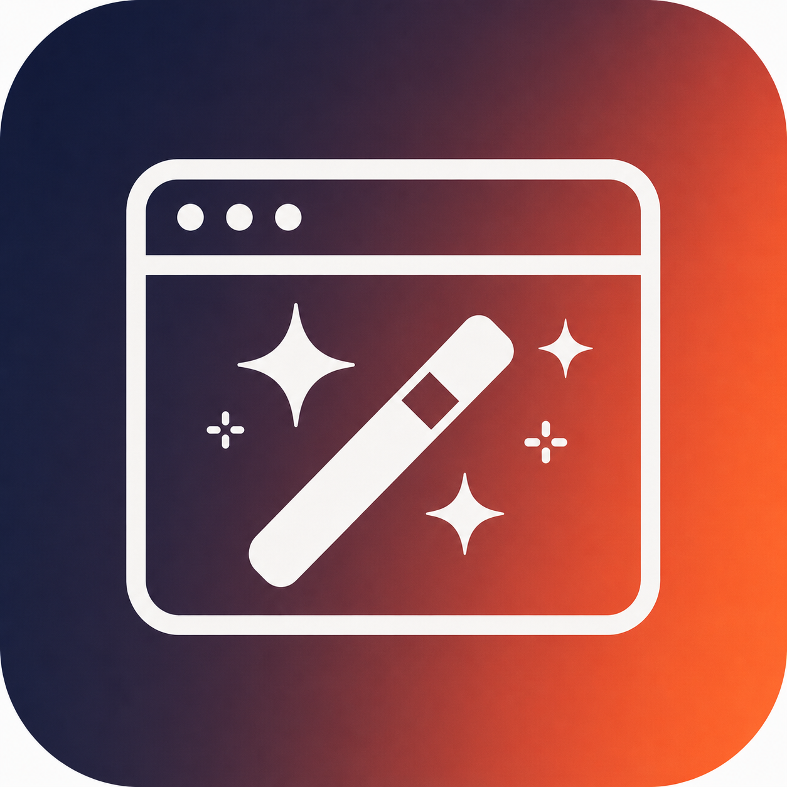

<p align="center">
  
</p>

<h1 align="center">Stitchflow</h1>
<p align="center"><strong>让 AI 编程助手帮你做 UI 设计 — 自动读项目、写提示词、操作 Google Stitch 出图</strong></p>

<p align="center">
  <a href="README.md">🇺🇸 English</a>
</p>

<p align="center">
  
  
  
  
  
</p>

---

## 演示视频

<video src="demo.mp4" controls width="100%"></video>

> 全程自动化：读项目 → 写 prompt → 选平台 → 切模型 → 生成设计 → 截图输出

## 这个项目是干嘛的？

平常你让 AI 帮你设计一个网页界面、Dashboard 或者 Landing Page，AI 只能靠文字描述，或者用代码画个大概。你想看到真正好看的设计稿，就得自己打开 Figma 画，或者打开 Google Stitch 手动输入提示词。

Stitchflow 做的事情就是：**让 AI 自动帮你操作 Google Stitch 出设计图**。你只需要告诉 AI「我想要一个电商数据看板」，AI 会先去读你项目的实际资料（品牌色、产品数据、用户画像），然后写一段真正贴合你业务的提示词，自动打开 Stitch 生成设计稿，最后截图给你看。满意了就导出 HTML/CSS 代码，AI 再帮你转成实际可用的前端代码。

整个过程你不需要手动打开 Stitch、不需要自己琢磨提示词怎么写、不需要复制粘贴。AI 全自动完成。

## 和谷歌官方的 stitch-skills 有什么不同？

谷歌有一个 [stitch-skills](https://github.com/google-labs-code/stitch-skills) 项目，它是通过 MCP 服务器来调用 Stitch 的。但它做不到「从你的项目里自动提取上下文再生成设计」这个闭环。

Stitchflow 的做法不同：它不是 MCP，而是直接通过 Chrome DevTools Protocol (CDP) 操控你已经登录了 Google 账号的浏览器。好处是：

- **不需要 API Key**：用的是你浏览器里已经登录的 Google 账号
- **不需要额外配置**：不需要填任何 token 或者密钥
- **自动读项目**：AI 会先读懂你的 CLAUDE.md、产品数据、品牌信息，再写提示词
- **完整链路**：项目理解 → 提示词 → 生成设计 → 截图 → 导出代码 → AI 转成前端代码

可以理解为：stitch-skills 给你的是工具箱，Stitchflow 给你的是全自动流水线。

## 安装

```bash
# 1. 安装依赖
pip install playwright && playwright install chromium

# 2. 在 Chrome 浏览器里登录 Google 账号，然后打开 https://stitch.withgoogle.com/ 一次

# 3. 安装到你的 AI 编程助手
# Claude Code:
cp -r stitchflow ~/.claude/skills/

# Codex CLI:
cp -r stitchflow ~/.agents/skills/

# OpenClaw:
openclaw skill install --path ./stitchflow

# Cursor / Hermes / Gemini CLI:
cp -r stitchflow ~/.cursor/skills/     # Cursor
cp -r stitchflow ~/.hermes/skills/     # Hermes
cp -r stitchflow .agents/skills/       # Gemini CLI
```

## 怎么用？

### 方式一：在你的 AI 助手里直接用（推荐）

安装后，直接跟 AI 说：

> 「帮我设计一个 SaaS 数据看板，深色主题」

AI 会自动：
1. 读取你项目的 CLAUDE.md、产品数据、品牌色
2. 写一段贴合你业务的 Stitch 提示词
3. 启动 Chrome CDP 模式
4. 打开 Stitch → 选择「網頁」平台 → 自动切换最强模型 → 输入提示词 → 按 Enter 生成
5. 等待完成后截图给你看
6. 你满意了就导出 HTML，AI 再转成前端代码

### 方式二：命令行直接跑

```bash
# 首次使用：启动 CDP 模式的 Chrome（会关闭现有 Chrome 窗口）
python3 stitch.py --launch-chrome

# 生成设计
python3 stitch.py "你的完整设计提示词" --output dashboard.png

# 完整流程（启动 + 生成 + 导出）
python3 stitch.py "你的提示词" --launch-chrome --output dashboard.png --export .stitch/designs/
```

## 工作流程（六个阶段）

```
项目上下文 → 定制提示词 → Stitch 生成 → 截图确认 → 导出 HTML → AI 写代码
```

| 阶段 | 谁在做 | 做什么 |
|------|--------|--------|
| 1. 读懂项目 | AI | 读取 CLAUDE.md、产品数据、品牌素材、现有 UI 代码 |
| 2. 写提示词 | AI | 根据项目实际情况撰写 Stitch 提示词，包含品牌色、用户画像、页面结构、功能需求 |
| 3. 启动浏览器 | 脚本 | 关闭现有 Chrome → 克隆 profile 保留登录态 → 以 CDP 模式重启 |
| 4. 自动生成 | 脚本 | 连接 CDP → 打开 Stitch 首页 → 选择「網頁」平台 → 自动切换最强模型 → 键盘输入提示词 → 按 Enter 创建项目 → 轮询等待完成 |
| 5. 截图确认 | AI | 截图展示给用户，用户确认方向 |
| 6. 导出 + 写代码 | 脚本+AI | 导出 HTML/CSS → AI 读取 → 转成 React/Vue/静态页面 |

## 跨平台支持

| | macOS | Windows | Linux |
|--|-------|---------|-------|
| Chrome 路径 | `/Applications/Google Chrome.app/...` | `%PROGRAMFILES%\Google\Chrome\...` | `google-chrome` (PATH) |
| Profile 路径 | `~/Library/Application Support/Google/Chrome` | `%LOCALAPPDATA%\Google\Chrome\User Data` | `~/.config/google-chrome` |
| 特殊要求 | 无 | Chrome 136+ 需额外参数 | 无 |

## 跨 AI 助手兼容

一份 SKILL.md，兼容以下所有平台（遵循 [agentskills.io](https://agentskills.io) 开放标准）：

| 助手 | 安装路径 | 调用方式 |
|------|---------|---------|
| Claude Code | `~/.claude/skills/` | `/stitchflow` |
| Codex CLI | `~/.agents/skills/` | `$stitchflow` |
| OpenClaw | `openclaw skill install` | `stitchflow` |
| Hermes | `~/.hermes/skills/` | 自动检测 |
| Cursor | `~/.cursor/skills/` | 自动检测 |
| Gemini CLI | `.agents/skills/` | 自动检测 |

## 关于模型选择

Stitch 默认使用标准模型。**始终切换当前可用的最强模型**（模型列表会随 Google 发布新模型而不断更新）。规则很简单：选版本号最高、或标注 Pro/Ultra/Max 的那个。

更强的模型 → 更深度的设计推理 → 更细致、更有创意的设计稿。代价是生成时间稍长（约 60-120 秒 vs 30-60 秒）。

> 模型切换已全自动化：脚本会打开模型下拉菜单，按版本号和 Pro/Thinking 标签评分配置最强模型，自动点击切换。

## 文件结构

```
stitchflow/
├── SKILL.md          # 英文版技能定义（给 AI 看的执行指南）
├── SKILL.zh-CN.md    # 中文版技能定义
├── stitch.py         # 核心脚本：CDP 启动 + Stitch 自动化 + 导出
├── icon.png          # 技能图标 (1024×1024)
├── demo.mp4          # 演示视频
├── README.md         # 英文版 README
├── README.zh-CN.md   # 本文件（中文版 README）
└── LICENSE           # MIT
```

## 常见问题

| 问题 | 原因 | 解决办法 |
|------|------|---------|
| 「未检测到 Stitch iframe」 | 浏览器没登录 Google 或没访问过 Stitch | 在 Chrome 里登录 Google 账号，打开 stitch.withgoogle.com 一次 |
| 「CDP 连接失败」 | Chrome 没以 CDP 模式启动 | 先运行 `python3 stitch.py --launch-chrome` |
| 「生成失败 / 按钮找不到」 | Stitch 界面改版 | **已修复**：新流程不再依赖生成按钮 — 改为首页输入提示词后按 Enter 键，Stitch 自动创建项目并开始生成 |
| 「生成太快（几秒就完成）」 | 提示词没正确注入，或检测过早误判 | 脚本已修复：使用键盘逐字输入 + 改进的生成检测逻辑。如果仍有问题，检查 CDP 连接是否正常 |
| 「设计看起来是手机端」 | 平台选择器没选对，Stitch 默认是「應用程式」模式 | **已修复**：脚本现在会自动点击「網頁」radio 按钮并验证选中状态。如果仍有问题，请检查 Stitch 首页是否显示「網頁」为选中状态 |

## License

MIT © 2026 Leon

---

<p align="center">
  <sub>Built for the Agent Skills ecosystem — one file, 27+ platforms</sub>
</p>
